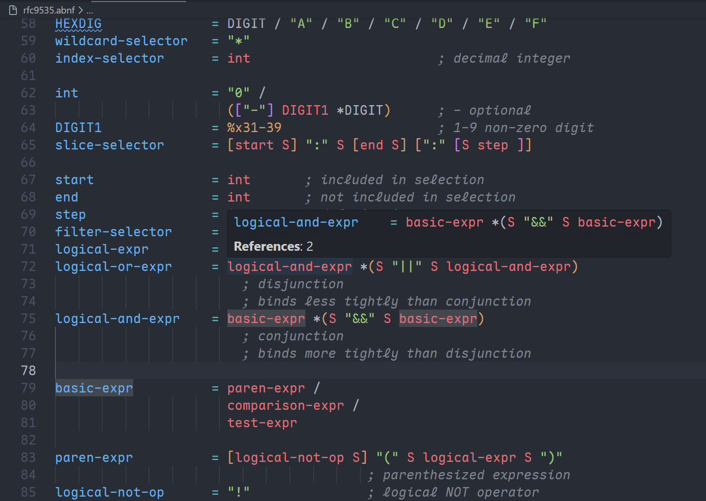

# vscode-abnf

> ABNF (Augmented Backus-Naur Form) language support for Visual Studio Code

Language support for [ABNF](https://datatracker.ietf.org/doc/html/rfc5234) grammars, compliant with [RFC 5234](https://datatracker.ietf.org/doc/html/rfc5234) and [RFC 7405](https://datatracker.ietf.org/doc/html/rfc7405).

<p align="center">
  
</p>

## Features

- **Syntax Highlighting** — Full support for ABNF syntax including rule definitions, literals, numeric values, and comments
- **Go to Definition** — Navigate to rule definitions with `F12`
- **Find References** — Find all references to a rule with `Shift+F12`
- **Hover** — Hover over rule names to see their definitions
- **Auto-completion** — Intelligent rule name completion as you type
- **Document Symbols** — Outline view for navigating rules in the current file

## Language Support

This extension supports all standard ABNF constructs:

| Construct        | Example                     |
| ---------------- | --------------------------- |
| Rule Definition  | `rule-name = / alternation` |
| String Literal   | `"string"`                  |
| Case-Sensitive   | `%s"Case-Sensitive"`        |
| Case-Insensitive | `%i"case-insensitive"`      |
| Binary           | `%b01010010`                |
| Decimal          | `%d114`                     |
| Hexadecimal      | `%x72.72`                   |
| Prose Val        | `<some prose>`              |
| Repetition       | `1*3`, `*`, `3`             |
| Group            | `(elem1 elem2)`             |
| Option           | `[optional]`                |
| Alternation      | `elem1 / elem2`             |
| Concatenation    | `elem1 elem2`               |

### Core Rules

RFC 5234 core rules are highlighted with special styling:

`ALPHA`, `BIT`, `CHAR`, `CR`, `CRLF`, `CTL`, `DIGIT`, `DQUOTE`, `HEXDIG`, `HTAB`, `LF`, `LWSP`, `OCTET`, `SP`, `VCHAR`, `WSP`

## Extension Settings

This extension contributes no custom settings.

## Known Issues

None currently. Please report issues via the GitHub issue tracker.

## Development

```bash
# Install dependencies
npm install

# Compile
npm run compile

# Watch mode
npm run watch

# Run linting
npm run lint

# Run tests
npm run test

# Package extension
npm run package
```

## License

MIT

## Related

- [RFC 5234 - Augmented BNF for Syntax Specifications: ABNF](https://datatracker.ietf.org/doc/html/rfc5234)
- [RFC 7405 - Case-Sensitive String Support in ABNF](https://datatracker.ietf.org/doc/html/rfc7405)
- [tree-sitter-abnf](https://github.com/saltfishpr/tree-sitter-abnf) — Tree-sitter grammar for ABNF
